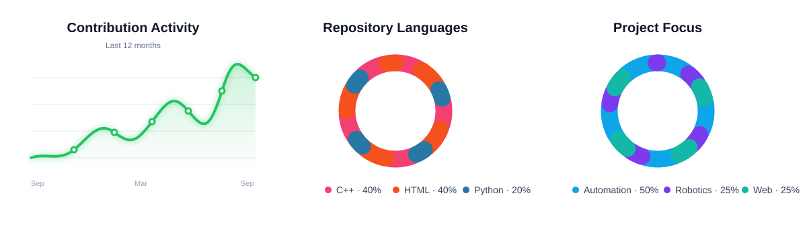

<p align="center">
  
</p>

<h3 align="center">Turning repetitive work into intelligent systems.</h3>

<p align="center"><strong>Personal accounts</strong></p>

<p align="center">
  <a href="https://t.me/unesjami"></a>
  <a href="https://www.linkedin.com/in/unesjami"></a>
  <a href="https://www.facebook.com/unes.jami.2025/"></a>
  <a href="https://www.instagram.com/unesjami2007"></a>
  <a href="mailto:unesjami2020@gmail.com"></a>
  <a href="https://github.com/unesjami"></a>
</p>

<p align="center"><strong>Featured products</strong></p>

<p align="center">
  <a href="https://t.me/PostOptimizeBot"></a>
  <a href="https://unesjami.github.io/TimeOS/"></a>
  <a href="https://unesjami.github.io/Word-Update/"></a>
</p>

## About Me

I'm **Unes Jami**, an AI Automation Engineer and Mechatronics student building practical systems where software, artificial intelligence, and hardware meet.

- Building AI-powered workflows and API integrations
- Developing Telegram bots and community automation
- Exploring computer vision and human–robot interaction
- Creating embedded systems with Arduino and ESP32
- Building useful digital products under **Faranovin**

```python
unes = {
    "role": "AI Automation Engineer",
    "focus": ["AI Agents", "Telegram Automation", "Computer Vision", "Robotics"],
    "mission": "Build systems that save time, scale ideas, and solve real problems.",
}
```

## GitHub Activity

<p align="center">
  
</p>

## Technology Stack

<h3 align="center">AI, Automation & Backend</h3>

<p align="center">
  
</p>

<p align="center">
  
  
  
  
</p>

<h3 align="center">Robotics, Embedded & Computer Vision</h3>

<p align="center">
  
  
  
  
</p>

<h3 align="center">Web & Development Tools</h3>

<p align="center">
  
</p>

## Projects by Category

<table>
<tr>
<td width="33%" align="center" valign="top">

### Telegram & AI

<a href="https://t.me/PostOptimizeBot"></a><br>
<br>
<br>
<a href="https://github.com/unesjami/AI-Powered-Content-Automation"></a>

<sub>Publishing, support, moderation and AI-assisted content.</sub>

</td>
<td width="33%" align="center" valign="top">

### Robotics

<a href="https://github.com/unesjami/Gesture-Interaction-Robot-GIR-"></a><br>
<a href="https://github.com/unesjami/Bluetooth-Controlled-Arduino-Car"></a>

<sub>Computer vision, gestures, Arduino and embedded electronics.</sub>

</td>
<td width="33%" align="center" valign="top">

### Web Apps

<a href="https://unesjami.github.io/TimeOS/"></a><br>
<a href="https://unesjami.github.io/Word-Update/"></a>

<sub>Time management and bilingual learning experiences.</sub>

</td>
</tr>
</table>

## Current Direction

- Building production-ready Telegram tools with polished user experiences
- Learning stronger AI-agent architecture and workflow orchestration
- Connecting computer vision with embedded robotic systems
- Growing **Faranovin** into a home for useful intelligent products

<p align="center"><strong>Build. Automate. Evolve.</strong></p>
