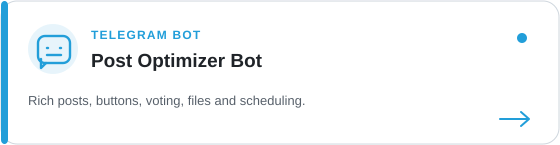
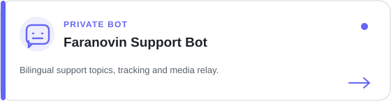
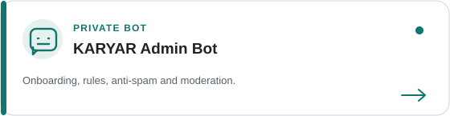
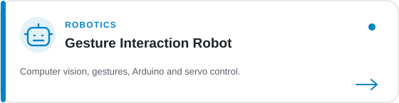
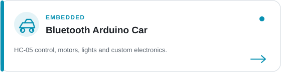
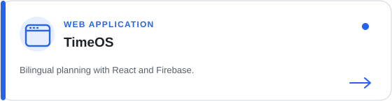
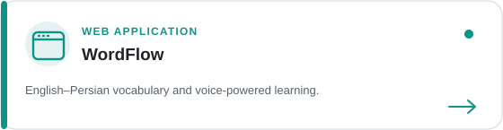

<p align="center">
  
</p>

<h3 align="center">Turning repetitive work into intelligent systems.</h3>

<p align="center"><strong>Personal accounts</strong></p>

<p align="center">
  <a href="https://t.me/unesjami"></a>
  <a href="https://www.linkedin.com/in/unesjami"></a>
  <a href="mailto:unesjami2020@gmail.com"></a>
  <a href="https://github.com/unesjami?tab=followers"></a>
</p>

<p align="center"><strong>Projects & products</strong></p>

<p align="center">
  <a href="https://t.me/PostOptimizeBot"></a>
  <a href="https://unesjami.github.io/TimeOS/"></a>
  <a href="https://unesjami.github.io/Word-Update/"></a>
</p>

## About Me

I'm **Unes Jami**, an AI Automation Engineer and Mechatronics student building practical systems where software, artificial intelligence, and hardware meet.

- Building AI-powered workflows and API integrations
- Developing Telegram bots and community automation
- Exploring computer vision and human–robot interaction
- Creating embedded systems with Arduino and ESP32
- Building useful digital products under **Faranovin**

```python
unes = {
    "role": "AI Automation Engineer",
    "focus": ["AI Agents", "Telegram Automation", "Computer Vision", "Robotics"],
    "mission": "Build systems that save time, scale ideas, and solve real problems.",
}
```

## GitHub Activity

<p align="center">
  
</p>

<p align="center">
  
  
</p>

## Technology Stack

<h3 align="center">AI, Automation & Backend</h3>

<p align="center">
  
</p>

<p align="center">
  
  
  
  
</p>

<h3 align="center">Robotics, Embedded & Computer Vision</h3>

<p align="center">
  
  
  
  
</p>

<h3 align="center">Web & Development Tools</h3>

<p align="center">
  
</p>

## Projects

<p align="center"><strong>Telegram Systems & AI Automation</strong></p>

<table>
<tr>
<td width="50%"><a href="https://t.me/PostOptimizeBot"></a></td>
<td width="50%"></td>
</tr>
<tr>
<td width="50%"></td>
<td width="50%"><a href="https://github.com/unesjami/AI-Powered-Content-Automation"></a></td>
</tr>
</table>

<p align="center"><strong>Robotics & Embedded Systems</strong></p>

<table>
<tr>
<td width="50%"><a href="https://github.com/unesjami/Gesture-Interaction-Robot-GIR-"></a></td>
<td width="50%"><a href="https://github.com/unesjami/Bluetooth-Controlled-Arduino-Car"></a></td>
</tr>
</table>

<p align="center"><strong>Web Applications</strong></p>

<table>
<tr>
<td width="50%"><a href="https://unesjami.github.io/TimeOS/"></a></td>
<td width="50%"><a href="https://unesjami.github.io/Word-Update/"></a></td>
</tr>
</table>

## Current Direction

- Building production-ready Telegram tools with polished user experiences
- Learning stronger AI-agent architecture and workflow orchestration
- Connecting computer vision with embedded robotic systems
- Growing **Faranovin** into a home for useful intelligent products

<p align="center">
  <strong>Build. Automate. Evolve.</strong>
</p>
